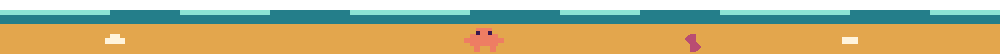
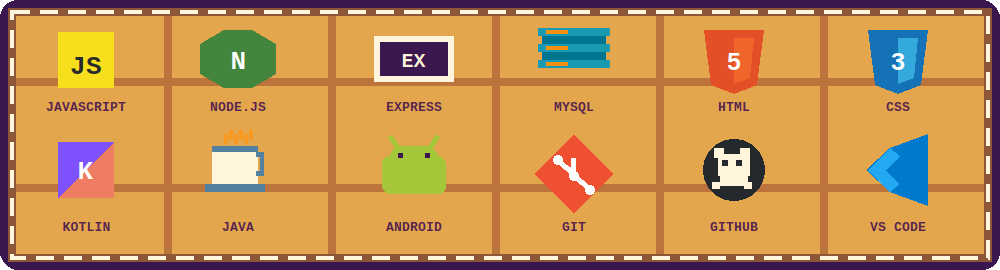
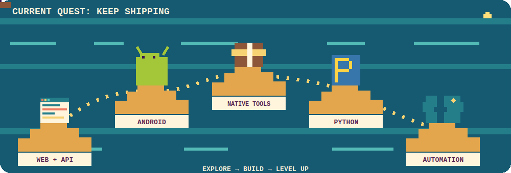
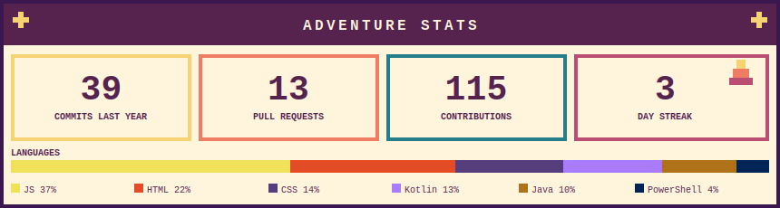
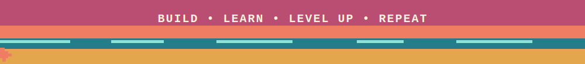

  

  

  &nbsp;
  &nbsp;
  &nbsp;
  &nbsp;
  

## 👾 hey!! i'm ch!!

I'm a developer and student at **Singapore Polytechnic** who likes turning small, annoying problems into software that quietly gets the job done.

- 🧩 I build practical automation, browser tools, Android apps, and full-stack web experiences.
- ⚙️ I enjoy working across the stack—from interfaces and APIs to databases and native utilities.
- 🌱 I'm currently sharpening my backend engineering, mobile development, and product design skills.
- 💬 Ask me about JavaScript, Node.js, Chrome extensions, Kotlin, or automating repetitive workflows.

## 🗺️ Featured Quests

<table>
  <tr>
    <td width="50%" valign="top">
      <h3><a href="https://github.com/chonghaoooi/SP-Auto-Authentication">🔐 SP Auto Auth</a></h3>
      
A Chrome/Edge extension that streamlines the multi-step Microsoft sign-in flow for SP students, including time-based one-time codes.

      
<code>JavaScript</code> <code>Chrome MV3</code> <code>TOTP</code>

    </td>
    <td width="50%" valign="top">
      <h3><a href="https://github.com/chonghaoooi/ATS-alarm">⏰ ATS Alarm</a></h3>
      
A configurable Android timetable alarm with week-aware scheduling, JSON import, and full-screen reminders.

      
<code>Kotlin</code> <code>Java</code> <code>Android</code>

    </td>
  </tr>
  <tr>
    <td width="50%" valign="top">
      <h3><a href="https://github.com/chonghaoooi/BED-CA2">🕵️ Wellness Detective</a></h3>
      
A full-stack wellness challenge wrapped in a detective game—complete tasks, uncover clues, and climb the leaderboard.

      
<code>Node.js</code> <code>Express</code> <code>MySQL</code>

    </td>
    <td width="50%" valign="top">
      <h3><a href="https://github.com/chonghaoooi/Picture-in-Picture-EVERYTHING">🖼️ Picture-in-Picture Everything</a></h3>
      
Lightweight Windows utilities that keep images and websites floating above the rest of your workspace.

      
<code>PowerShell</code> <code>VBScript</code> <code>Windows</code>

    </td>
  </tr>
</table>

## 🎒 Tool Inventory

  

## ⛵ Island Quest Map

  

## 🧭 Adventure Stats

  

  

